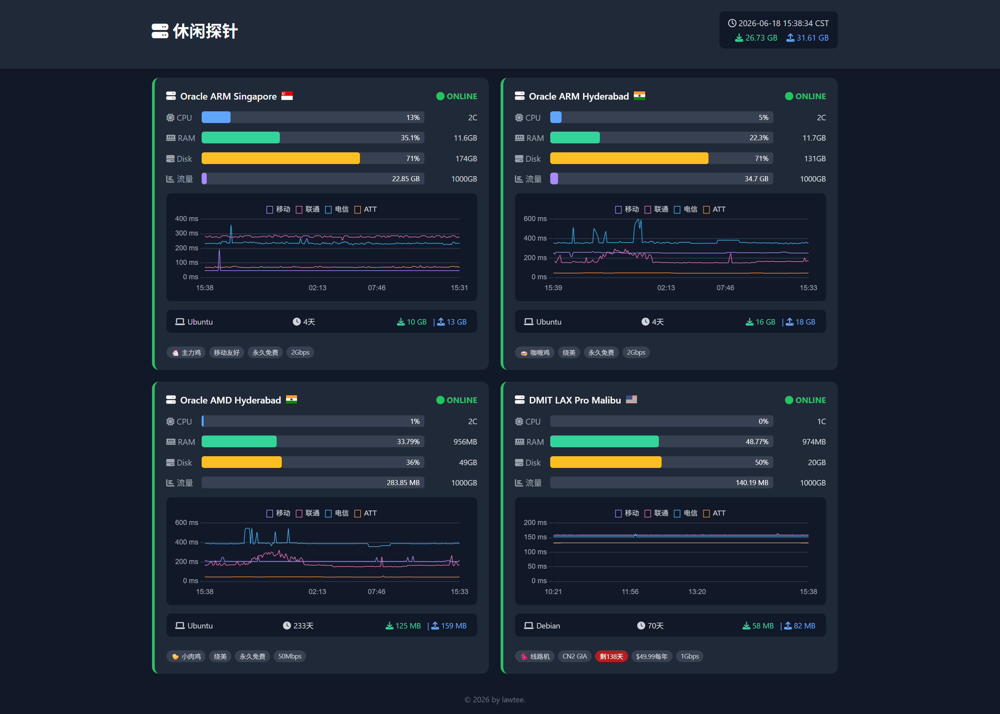

# 休闲探针 (Simple Server Monitor)

一个轻量级、自托管的服务器状态探针，使用 Shell 脚本采集系统指标，通过 PHP 接收并存储到 SQLite，再由简洁的 Web 面板展示实时数据和历史延迟曲线。

**特点：**
- 📡 纯被动上报：客户端单向发送数据，无任何远程控制功能，安全可靠
- 🧩 极简架构：客户端 Shell 脚本 + 服务端 PHP + SQLite，无需 MySQL/InfluxDB 等复杂依赖
- 📊 可视化面板：CPU/内存/磁盘/流量进度条，四线 Ping 延迟历史图，系统信息与自定义标签
- 🔐 安全设计：Token 验证、WAF 白名单（Cloudflare）、数据库禁止外部下载、最低权限运行
- 📱 响应式界面：手机 / 电脑均友好
- ⏱️ 自动刷新：30 秒动态更新实时数据，无需手动刷新页面
- 🚀 一键部署：客户端仅需一条命令安装，服务端直接上传 PHP 文件即可

---

## 演示站点

🔗 [https://status.hyruo.com](https://status.hyruo.com)  



---

## 快速开始

### 服务端部署（需要 PHP 环境，推荐 Nginx + PHP-FPM）

1. 将 `index.php`、`report.php` 上传到网站目录（例如 `/www/sites/status.hyruo.com/index/`）。
2. 确保 PHP 有 SQLite3 扩展（默认通常已安装）。
3. 配置 Nginx 禁止直接访问数据库文件：
   ```nginx
   location ^~ /data/ {
       deny all;
   }
   ```
4. 可选：在 Cloudflare 上创建 WAF 规则，限制 `/report.php` 仅允许你的客户端 IP 访问。

### 客户端部署（在每台被监控的 VPS 上执行）

1. 下载安装脚本：
   ```bash
   curl -O https://你的域名/install.sh
   ```
2. 以 root 运行，指定你的唯一 token（每台机器应使用不同 token）：
   ```bash
   chmod +x install.sh
   ./install.sh <你的TOKEN>
   ```
   安装脚本会自动：
   - 创建低权限用户 `hyruo`
   - 将客户端脚本安装到 `/opt/hyruo/client.sh`
   - 将 token 安全存储在 `/opt/hyruo/env`（仅 root 可读）
   - 注册 `systemd` 服务并立即启动

3. 查看运行状态：
   ```bash
   systemctl status hyruo
   journalctl -u hyruo -f
   ```

### 服务端配置修改

编辑 `index.php` 和 `report.php` 中的用户配置区，填入你的节点信息：

- `$TOKENS`：客户端 token 的 MD5 值（`report.php` 中需填 token 原文，`index.php` 中需填 MD5）
- `$TRAFFIC_LIMIT`：每台服务器的流量配额（GB）
- `$CUSTOM_TAGS`、`$EXPIRE_DATES`、`$OTHER_TAGS`：自定义标签

> 如何计算 token 的 MD5？  
> 在 Linux 终端执行：`echo -n "你的token原文" | md5sum`

---

## 项目结构

```
/
├── index.php          # 展示面板（含 Ajax 实时数据接口）
├── report.php         # 数据接收端（客户端 POST 到此文件）
├── install.sh         # 客户端一键安装脚本
├── data/              # 自动生成的 SQLite 数据库目录（禁止外部访问）
│   └── status_v2.db
└── screenshot.png     # 演示截图
```

---

## 安全实践

- **Token 隔离**：每台客户端使用不同的 token，即使泄露也仅影响单机上报
- **最小权限**：客户端以 `hyruo` 用户运行，脚本文件属主 root 且不可被 `hyruo` 修改
- **只读面板**：展示页面仅读取数据，没有任何写入或管理功能
- **边缘防护**：推荐使用 Cloudflare 代理域名并配置 WAF 规则，进一步限制对 `report.php` 的访问
- **数据库保护**：Nginx 禁止直接访问 `/data/` 目录；数据库仅存储运行指标，无 IP、密码等敏感信息

---

## 常见问题

**Q: 为什么修改了服务器名称后，页面仍然显示旧名称？**  
A: 需要同时修改 `index.php` 和 `report.php` 中的 `$TOKENS` 数组，然后等待客户端下一次上报（或重启客户端服务）。名称由 `report.php` 在上报时写入数据库，`index.php` 读取数据库显示。

**Q: 历史图表时间轴不均匀？**  
A: 图表使用线性时间轴，会根据数据点的实际时间戳分布刻度，适应各种上报间隔。如果出现空白区域，通常是节点离线或数据不足。

**Q: 如何更换国旗图标？**  
A: 编辑 `index.php` 中的 `get_flag_class` 函数，将服务器名称映射到对应的国家代码（见 flag-icon-css 文档）。

---

## 致谢

- [Chart.js](https://www.chartjs.org/) – 图表库
- [Font Awesome](https://fontawesome.com/) – 图标
- [flag-icon-css](https://github.com/lipis/flag-icons) – 国旗图标
- 灵感来源于哪吒探针被攻击后的“紧急避险”，以及无数自建轮子的快乐。

---

## 许可

MIT License © 2026 Lawtee